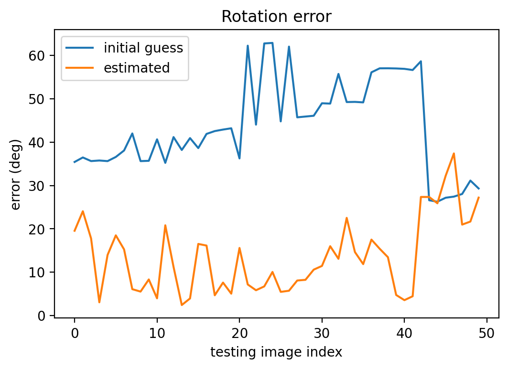

# Image Based Indoor Localization

An image-based localization framework based on work of Song et al, featuring hardware-accelerated image searching​ and optimization with GTSAM. We also test PIVO in this project for changing illumination settings, please refer to [PyojinKim/PIVO](https://github.com/PyojinKim/PIVO) for codes.

## Tutorial

1. Install libraries:
    ```
    conda create -n tf -c anaconda -c conda-forge tensorflow-gpu=2.4.1 opencv
    conda activate tf
    pip install progressbar nearpy tqdm h5py keras scipy matplotlib gtsam
    ```
2. Data processing
    1. Download [RGB-D Dataset 7-Scenes](https://www.microsoft.com/en-us/research/project/rgb-d-dataset-7-scenes/) and
       extract to `data` folder. Here we will use `chess` scene as example.
    2. Make sure you have following folder structure:
        ```
        ├─data
        │  ├─chess
        │  │  ├─seq-01
        │  │  ├─seq-02
        │  │  ├─seq-03
        │  │  ├─seq-04
        │  │  ├─seq-05
        │  │  ├─seq-06
        ```
    3. Run `mkdir -p model/chess/weights/ model/chess/training_data_info model/chess/cdf`
    4. Run `python scripts/split_dataset.py`
    5. Run `python scripts/generate_tf_records.py`
3. Compile fast searching module
    ```bash
    cd image_based_localization/search
    mkdir cmake-build-release
    cd cmake-build-release
    cmake -DCMAKE_BUILD_TYPE=Release ..
    make -j8
    ```
4. Train the model
    1. Install tensorflow-gpu, opencv and related libraries.
    1. Create folders for storing results:
        ```
        ├─model
        │  └─chess
        │      ├─training_data_info
        │      └─weights
        ```
    1. Run `python image_based_localization/siamese_network/train.py`. See all available arguments by
       running `python image_based_localization/siamese_network/train.py -h`.
    1. Run `python image_based_localization/siamese_network/test.py`. See all available arguments by
       running `python image_based_localization/siamese_network/test.py -h`.
5. Feature extraction \
    To compare results with original matlab codes, we use Matlab to produce features and then load them into our graph. In the future, this step will be replaced by OpenCV.

    1. Create folders for feature data:
        ```
        cd reference/matlab/BA_matlab/
        mkdir -p data/feature_matches_2d data/feature_matches_3d data/neighbor_id data/points_matches data/viewIds_matches
        ```
    1. Run `reference/matlab/BA_matlab/Main_GL.m`
    1. Check the feature files. if they look good, copy them to `data/chess/features` folder: 
    ```
        mkdir data/chess/features/
        cp -r reference/matlab/BA_matlab/data/* data/chess/features/
    ```
6. Optimization: run `python image_based_localization/main.py`

## Code structure

```
.
├── assets: images for this readme
├── data: dataset and features
├── experiments: gtsam experiements
├── image_based_localization: source file
│   ├── ba: bundle adjustment (GTSAM)
│   ├── search: GPU accerated search
│   ├── siamese_network: generate image descriptors
│   └── utils: who cares
├── model: weights and outputs for siamese networks
├── reference: matlab code from original framework
└── scripts: scripts for preprocessing dataset
```

## Some results
- Angle error for chess dataset: \
    
- landmark triangulation \
    

## Reference

- [Kim et al., “Robust Visual Odometry to Irregular Illumination Changes with RGB-D Camera”, 2015]​

- [Luca Carlone, Zsolt Kira, Chris Beall, Vadim Indelman, and Frank Dellaert, "Eliminating conditionally independent sets in factor graphs: a unifying perspective based on smart factors", Int. Conf. on Robotics and Automation (ICRA), 2014]

- [Park et al., “Illumination Change Robustness in Direct Visual SLAM”, 2017]​

- [Shotton et al., “Scene Coordinate Regression Forests for Camera Relocalization in RGB-D Images”, 2013]​

- [Song et al., “Fusing Convolutional Neural Network and Geometric Constraint for Image-Based Indoor Localization”, 2022]​